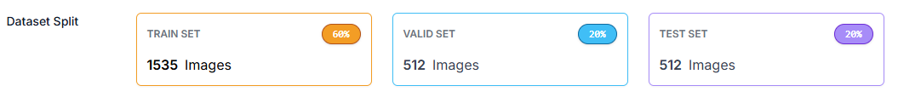
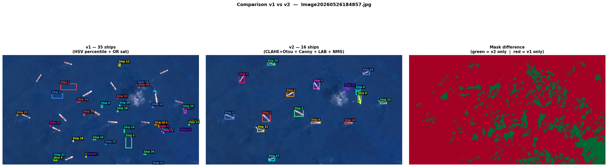
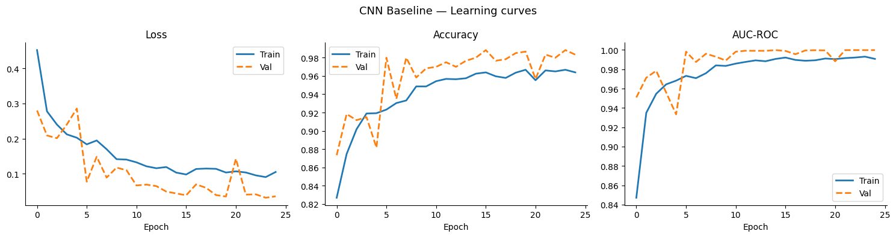
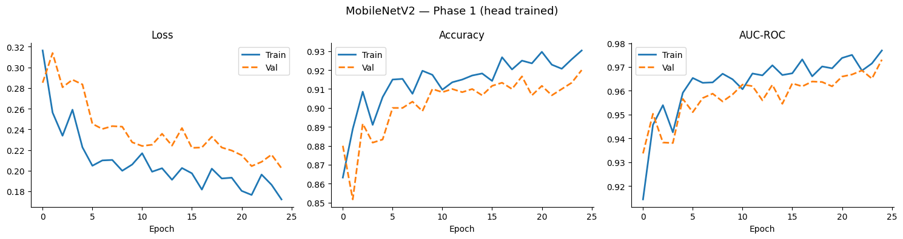
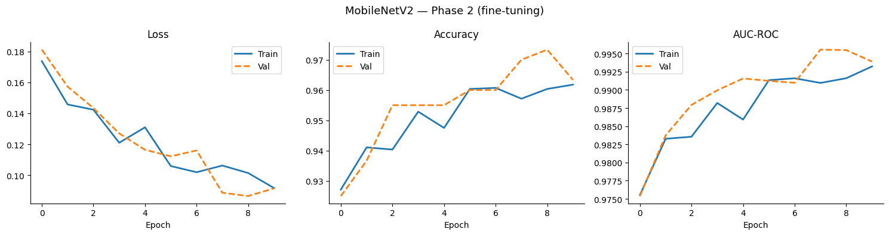

# Informe Final — Detección de Barcos en Imágenes Satelitales

**Cátedra de Computer Vision · Trabajo Práctico Final**
**Alumnos:** Leonardo Heis, Leandro Juarez, Maximiliano Miro

---

## 1. Motivación

La detección de embarcaciones en imágenes satelitales tiene aplicaciones directas en vigilancia marítima, control de
tráfico portuario, monitoreo de pesca ilegal y respuesta ante emergencias en alta mar. A diferencia de la vigilancia
con cámaras terrestres o aéreas, las imágenes satelitales permiten cubrir vastas extensiones oceánicas de forma
continua, pero plantean desafíos específicos: baja resolución relativa, variabilidad de iluminación y condiciones
climáticas, y objetos de interés muy pequeños (los barcos ocupan entre 20 y 50 px en las imágenes de entrenamiento).

El dominio elegido combina relevancia práctica con dificultad técnica genuina, lo que lo convierte en un banco de
pruebas idóneo para comparar enfoques clásicos y basados en aprendizaje profundo.

---

## 2. Dataset

### Origen

Se utilizaron 2 datasets para diferentes propòsitos del proyecto:
- **ShipsNet** (Kaggle): 4000 chips de 80×80. (`rhammell/ships-in-satellite-imagery`)
- **Roboflow**: 2559 chips anotados con bounding boxes para entrenamiento de YOLO11.
El dataset principal para entrenamiento de YOLO11 fue el de Roboflow, el cual toma cierta cantidad de imagenes con
diferentes anotaciones, y se divide en train/valid/test. 
El dataset de ShipsNet se utilizó para subir a roboflow unas 300 imágenes positivas y anotarlas con bounding boxes 
utilizando la herramienta Auto Label, para luego entrenar el modelo de YOLO11.

### Composición y origen del dataset anotado

El dataset utilizado para entrenar el modelo proviene de **Roboflow** (proyecto `ship-4jnj0-ku1a7`). Como
punto de partida se seleccionaron 300 imágenes positivas del dataset **shipsnet de Kaggle** y se subieron a
Roboflow, donde se anotaron con bounding boxes usando **Auto Label** (Grounding DINO / SAM). Las anotaciones
automáticas fueron revisadas manualmente para corregir casos evidentes. Roboflow generó el split final y
exportó el dataset en formato YOLOv11.

| Split | Imágenes | Anotaciones (ship) |
|---|---|---|
| Train | 1535 | 7488 |
| Valid | 512 | 2606 |
| Test | 512 | 2768 |
| **Total** | **2559** | **12862** |

La división 60/20/20 fue configurada automáticamente por Roboflow. Se justifica porque con ~2500 imágenes anotadas
es importante destinar suficiente volumen al entrenamiento, mientras que los conjuntos de validación y test son lo
suficientemente grandes (512 imágenes c/u) para obtener métricas estables. El test set nunca fue visto durante el
entrenamiento ni la selección de hiperparámetros.

### Criterios de etiquetado y casos ambiguos

- **Objeto válido:** cualquier embarcación con silueta claramente visible y al menos el 50% del casco dentro
  del chip.
- **Casos ambiguos:** (a) barcos parcialmente cubiertos por nubes o sombras de edificios portuarios, se
  incluyeron si la silueta era reconocible; (b) estructuras portuarias fijas (muelles, diques) que se asemejan
  visualmente a barcos, se excluyeron; (c) un pequeño subconjunto de anotaciones contenía máscaras de
  segmentación generadas automáticamente que fueron descartadas durante el entrenamiento por Ultralytics
  (warning: *mixed detect-segment dataset*), afectando levemente la calidad de supervisión.
- La densidad promedio es ~5 barcos/imagen, con alta variabilidad: desde escenas de alta mar con un solo barco
  hasta puertos con más de 20 embarcaciones visibles.

---

## 3. Detector Clásico (OpenCV)

### Enfoque implementado

El detector clásico (`satellite_ship_pipeline.ipynb`) aplica la siguiente cadena de procesamiento:

1. Conversión al espacio de color HSV
2. Extracción del **canal de saturación** para detectar barcos con pintura colorida (rojo, naranja, blanco)
3. Umbralización binaria adaptativa
4. **Operaciones morfológicas** (cierre morfológico para unir regiones fragmentadas, apertura para eliminar
   ruido puntual)
5. Detección de contornos (`cv2.findContours`)
6. Filtrado por **área mínima** y **relación de aspecto** (los barcos son objetos elongados, aspect ratio > 1.5)

### Análisis de casos exitosos y fallidos

**Detecta bien:**
- Barcos de colores contrastantes sobre agua oscura: la diferencia de saturación es alta y el umbral los
  captura con facilidad.
- Escenas con pocos barcos y fondo uniforme: baja tasa de falsos positivos en aguas abiertas.

**Falla en:**
- Barcos grises o blancos sobre mar claro o con espuma: el contraste de saturación es insuficiente.
- Zonas portuarias con muchas estructuras: la morfología no puede distinguir siluetas de barcos de diques
  o grúas.
- Barcos muy pequeños (< 10 px): quedan por debajo del umbral de área mínima.
- Barcos en diagonal: cuando un barco está girado, el rectángulo que OpenCV dibuja alrededor suyo queda
  casi cuadrado (porque el largo del barco se reparte entre ancho y alto del rectángulo). El filtro de
  forma lo descarta pensando que no es un barco, aunque sí lo sea.

**¿Por qué el enfoque clásico no es adecuado para este dominio?**
Las imágenes satelitales presentan variabilidad fotométrica extrema (distintas horas del día, cobertura nubosa,
profundidad del agua). Un conjunto fijo de parámetros de umbralización funciona bien en un subconjunto de
imágenes y falla en otro. Sin contexto semántico aprendido, el detector no puede distinguir un barco de una
estructura portuaria rectangular con similares propiedades espectrales.

### CNN y MobileNetV2 como clasificadores de chips

El notebook `satellite_ship_pipeline.ipynb` implementa un pipeline de dos etapas que combina el detector clásico
con clasificadores neuronales:

**Etapa A (detección):** el detector OpenCV extrae recortes (*crops*) candidatos de 80×80 px de la imagen
completa.
**Etapa B (clasificación):** una red neuronal clasifica cada recorte como *ship* / *no ship*.

Se entrenaron dos clasificadores sobre los chips etiquetados de shipsnet (split 70/20/10 sobre 4 000 chips,
balanceado a 600 imágenes de test):

#### CNN Baseline (arquitectura propia, entrenada desde cero)

Red convolucional ligera entrenada directamente sobre los chips de 80×80 px. Prioriza el recall para minimizar
falsos negativos en vigilancia marítima.

| Métrica | Valor (test set) |
|---|---|
| Accuracy | 0.963 |
| Precision (ship) | 0.886 |
| **Recall (ship)** | **0.980** |
| F1-Score (ship) | 0.930 |
| AUC-ROC | 0.9945 |

#### MobileNetV2 con Transfer Learning (ImageNet)

Entrenamiento en dos fases: primero solo el clasificador (*head*, 82 049 params entrenables), luego fine-tuning
de los últimos 5 bloques de features (1 763 393 params entrenables) con lr reducido.

| Métrica | Valor (test set) |
|---|---|
| Accuracy | 0.965 |
| **Precision (ship)** | **0.964** |
| Recall (ship) | 0.893 |
| F1-Score (ship) | 0.927 |
| AUC-ROC | 0.9933 |

#### Comparación CNN vs MobileNetV2

| Criterio | CNN Baseline | MobileNetV2 |
|---|---|---|
| Recall | **0.980** | 0.893 |
| Precision | 0.886 | **0.964** |
| AUC-ROC | **0.9945** | 0.9933 |
| Params entrenables | mayor | 82 k (fase 1) / 1,76 M (fase 2) |
| Convergencia | rápida | más estable con fine-tuning |

**Conclusión parcial:** la CNN baseline supera a MobileNetV2 en recall (0.98 vs 0.89), lo cual es prioritario
para vigilancia marítima. MobileNetV2 domina en precisión. Ambos modelos alcanzan accuracy ~96%, confirmando que
los chips de 80×80 px contienen suficiente señal para clasificación, pero **no proveen coordenadas de bounding
box**, lo que los limita frente a YOLO11 para tareas de detección real.

Se aplicó **Grad-CAM** sobre MobileNetV2 (`features[-1]`) para verificar que el modelo activa regiones
correspondientes a la silueta del barco, y no a artefactos del fondo.

El modelo final se exportó a `models/mobilenet_ship.pth` (9.5 MB) y `models/mobilenet_ship.onnx` (9.2 MB)
para inferencia portable.

---

## 4. Entrenamiento YOLO11

### Experimentos realizados

Se realizaron tres corridas de entrenamiento variando hiperparámetros progresivamente:

| Corrida | epochs | imgsz | cls | mosaic | degrees | Tiempo | mAP@50 (test) | Precision | Recall | Directorio de run | Mejor modelo |
|---|---|---|---|---|---|---|---|---|---|---|---|
| **v1** (baseline) | 30 | 640 | 0.5 | 1.0 | 30° | 0.621 h | 0.463 | 0.507 | 0.401 | [ship_detection_v15](https://drive.google.com/drive/folders/13tbZ-qTvA6d2RbKX94jk7WqH6TFr-qGx?usp=sharing) | `weights/best.pt` |
| **v2** (+epochs, +cls) | 100 | 640 | 1.5 | 1.0 | 30° | 1.821 h | 0.616 | 0.748 | 0.468 | [ship_detection_v14](https://drive.google.com/drive/folders/1QLzTo6d1JXQ_SMTR4IFBsTHeHSLaPGlR?usp=sharing) | `weights/best.pt` |
| **v3** (+imgsz, −cls, tune aug) | 120 | 960 | 0.5 | 0.5 | 10° | 3.909 h | 0.611 | 0.748 | 0.469 | [ship_detection_v32](https://drive.google.com/drive/folders/1adkPw0RD0CnFBkwTu4ewQQo4fZOfJbKN?usp=sharing) | `weights/best.pt` |

Todos los experimentos usaron el modelo base `yolo11m.pt` (pretrained on COCO), optimizador AdamW con cosine LR
decay, y el mismo dataset de Roboflow.

### Análisis por experimento

**v1 → v2:** Duplicar los epochs (30→100) y aumentar el peso de pérdida de clasificación (`cls`: 0.5 to 1.5) fue
el cambio más impactante: el mAP@50 pasó de 0.463 a 0.616 (+33%). La pérdida de validación en v1 seguía
descendiendo al finalizar el entrenamiento, confirmando subajuste (*underfitting*) por número de epochs
insuficiente. El mayor `cls` penalizó más fuertemente los errores de clasificación de clase, mejorando la
precisión.

**v2 → v3:** Aumentar la resolución de entrada (640 to 960 px) y reducir `cls` de vuelta a 0.5 mejoró la
representación de barcos pequeños, pero la ganancia en mAP fue marginal (0.616 to 0.611) ya que el batch se redujo
a 3 imágenes (AutoBatch al 52% VRAM). Reducir `mosaic` de 1.0 a 0.5 y `degrees` de 30° a 10° moderó el ruido
de augmentación para escenas de alta mar donde la orientación real de los barcos varía poco.

### Métricas del mejor modelo (v2, evaluación en test set)

| Métrica | Valor |
|---|---|
| mAP@50 | **0.616** |
| mAP@50-95 | 0.339 |
| Precisión | 0.748 |
| Recall | 0.468 |
| Velocidad de inferencia | 12.6 ms/imagen (GPU) |

### Interpretación de las curvas de entrenamiento

- **mAP@50:** crece establemente hasta ~60 epochs y luego se estabiliza. No se observa sobreajuste (las
  métricas de validación no degradan respecto al train).
- **Box loss:** la pérdida de train desciende continuamente; la pérdida de validación se estabiliza en ~1.93,
  con una brecha pequeña respecto a train (1.69), indicando generalización razonable pero sin margen extra de
  datos.
- El modelo corrió los 120 epochs completos sin activar el early stopping (patience=50), lo que sugiere que
  el aprendizaje es lento pero estable.

### Análisis de la matriz de confusión

La matriz de confusión normalizada muestra que el modelo:
- Detecta correctamente barcos en contextos de alta densidad portuaria.
- Confunde barcos pequeños con el fondo (falsos negativos), lo que explica el recall bajo (0.47).
- Tiene pocas detecciones espurias sobre agua abierta (precisión alta: 0.75).

El patrón recall < precisión es consistente con la naturaleza del dominio: muchas instancias son barcos de
pequeño tamaño en zonas portuarias complejas, difíciles de localizar con exactitud.

### Análisis del umbral de confianza

El barrido sobre 20 imágenes de test mostró que el número de detecciones cae abruptamente por encima de
conf=0.40. Para vigilancia marítima, donde un falso negativo (barco no detectado) es más costoso que una falsa
alarma, se recomienda operar con **conf=0.20–0.30**.

### Inferencia sobre escenas satelitales completas *(Leandro Juárez)*

Las evaluaciones del grupo se realizaron sobre chips del conjunto de test de Roboflow. Leandro Juárez extendió
la evaluación ejecutando inferencia sobre **escenas completas de la Bahía de San Francisco** (~2500×1700 px)
en Google Colab con GPU T4, lo que expuso un problema de escala no visible con los chips de test.

**Problema de escala: chips de entrenamiento vs. escenas completas**

El modelo fue entrenado con chips de 80×80 px donde el barco ocupa gran parte del encuadre. En una escena
completa, un barco representa apenas 10–15 px de más de cuatro millones de píxeles totales. La red nunca vio
objetos a esa proporción durante el entrenamiento, por lo que los ignora por completo.

| Versión | Estrategia | Conf | Resultado en SF Bay |
|---|---|---|---|
| v1 — inferencia directa | Sin slicing | 0.25 | **0 detecciones** |
| v2 — SAHI | Tiles 320×320 px, 20% overlap + NMS | 0.30 | Barcos detectados (con FP) |

Aplicar SAHI transformó "cero detecciones" en detecciones reales con el mismo modelo, confirmando que el
slicing es imprescindible para inferencia sobre imágenes de mayor resolución que los chips de entrenamiento.

**Falsos positivos persistentes tras el slicing** *(Leandro Juárez)*

Después de aplicar SAHI persistieron falsos positivos en zonas de espuma y patrones de olas (texturas
similares a reflejos metálicos de cascos), estructuras portuarias con geometría rectangular (diques, grúas),
y variaciones de iluminación de SF Bay no representadas en ShipsNet. La causa es la distribución homogénea del
dataset: chips con barcos siempre centrados y fondos limpios, sin negativos difíciles de escenas portuarias
complejas.

**Entorno de ejecución y adaptación para macOS** *(Leandro Juárez)*

Todas las corridas de Leandro se realizaron en Google Colab con GPU T4, dado que el entorno local es macOS con
Apple Silicon. Para poder ejecutar exploración e inferencia sin depender de Colab se desarrolló
`ship_detection_macos.ipynb`, que detecta automáticamente el acelerador (MPS o CPU) y ajusta el batch.

| Aspecto | Colab (GPU T4) | macOS (MPS/CPU) |
|---|---|---|
| Acelerador | `cuda:0` | `mps` o `cpu` |
| Batch size | 32 | 8 (MPS) / 4 (CPU) |
| Credenciales | Colab Secrets | Archivo `.env` local |
| Tiempo (50 epochs) | ~15 min | Inviable para >10 epochs |

---

## 5. Comparación de enfoques

| Dimensión | Detector clásico (OpenCV) | CNN / MobileNetV2 | YOLO11m |
|---|---|---|---|
| **Precisión cualitativa** | Baja: falla en barcos grises, zonas portuarias y objetos pequeños | Alta para clasificación de chips: accuracy 96%, AUC-ROC 0.99 — pero no produce bounding boxes | Media-alta: mAP@50=0.61, localiza barcos con coordenadas en imágenes completas |
| **Facilidad de ajuste** | Alta para casos simples; requiere re-calibrar umbral y morfología por subdominio | Moderada: arquitectura fija, hiperparámetros estándar; requiere chips pre-recortados | Requiere datos anotados con bounding boxes y GPU; hiperparámetros con mayor transferibilidad |
| **Tiempo de desarrollo** | Rápido de implementar (~2 hs); difícil de mejorar sistemáticamente | Moderado: entrenamiento en minutos sobre chips de 80×80 px | Significativo por experimento: v1=0.621 h (30 ep), v2=1.821 h (100 ep), v3=3.909 h (120 ep, imgsz=960) |
| **Requisitos computacionales** | Mínimos: corre en CPU en tiempo real | Bajos: inferencia en CPU viable (modelo 9.5 MB); entrenamiento en GPU en minutos | GPU necesaria para entrenamiento; inferencia GPU a 25.8 ms/imagen |
| **Generalización** | Muy baja: los parámetros calibrados fallan en otra condición lumínica o escena | Media en clasificación de chips del mismo dominio; no generaliza a imágenes de diferente resolución o sensor | Media: generaliza dentro del dominio; requiere más datos para mejorar recall en barcos pequeños |
| **Salida del modelo** | Contornos y bounding rects aproximados | Etiqueta de clase + probabilidad (sin localización) | Bounding boxes con coordenadas + confianza |

**Conclusión comparativa:** el detector clásico sirve como línea base rápida. CNN/MobileNetV2 alcanza excelente
accuracy de clasificación con pocos recursos, pero depende del pipeline de OpenCV para recortar candidatos.
YOLO11 es el único enfoque end-to-end que produce detecciones con localización precisa en imágenes completas,
lo que lo hace el más adecuado para una aplicación real de vigilancia satelital, a pesar del recall moderado
(0.47).

---

## 6. Conclusiones

### ¿Qué aprendimos?

1. **El etiquetado es el cuello de botella.** La transición de chips clasificados (imagen-nivel) a bounding
   boxes requirió un proceso de anotación que, aun usando Auto Label, demandó revisión manual. Errores de
   anotación (cajas imprecisas, mezcla de máscaras de segmentación) se propagaron directamente al recall.

2. **Los epochs importan más que la arquitectura.** El salto de mAP más grande se obtuvo simplemente
   entrenando más epochs (30→100), no cambiando el modelo base ni la resolución. El modelo v1 estaba
   claramente subajustado.

3. **La resolución ayuda, pero el batch la limita.** Pasar de 640 a 960 px mejoró la representación de
   objetos pequeños, pero en una GPU de 8 GB el batch se reduce a 3, lo que hace que la ganancia sea
   marginal y el entrenamiento más lento.

4. **El recall es el indicador que debe guiar las decisiones.** Para vigilancia marítima, no detectar un
   barco es peor que una falsa alarma. Las decisiones de umbral de confianza y los criterios de anotación
   deben estar orientados a maximizar recall, aceptando pérdida de precisión.

5. **El detector clásico falla por falta de contexto semántico.** La umbralización y morfología no pueden
   aprender qué es un barco; solo capturan propiedades espectrales y geométricas locales, que son
   insuficientes para la diversidad del dominio satelital.

### ¿Qué haríamos diferente?

- **Anotar más imágenes.** Con ~1500 imágenes de train, el modelo llega a un límite. Duplicar el dataset
  (≥ 3000 train) es la mejora de mayor impacto esperado sobre el recall.
- **Aplicar SAHI** (*Sliced Inference Handling*) para dividir imágenes de alta resolución en tiles solapados,
  mejorando la detección de objetos pequeños sin aumentar la resolución de entrenamiento. *(Leandro Juárez
  verificó esto empíricamente: pasar de inferencia directa a SAHI sobre escenas de SF Bay transformó 0
  detecciones en detecciones reales con el mismo modelo entrenado.)*
- **Incorporar negativos difíciles específicos del dominio de inferencia al entrenamiento.** *(Leandro Juárez)*
  Los falsos positivos tras el slicing son consistentes: espuma, diques, grúas. Agregar chips negativos de
  esas zonas al dataset atacaría el problema en la raíz sin necesidad de reentrenar desde cero.
- **Usar Google Drive como caché permanente de datasets y pesos.** *(Leandro Juárez)* Trabajar en Colab
  implica descargar datasets y pesos en cada sesión si no se persiste en Drive, lo que ralentiza las
  iteraciones. Montar Drive como caché elimina esa fricción.
- **Revisar manualmente las anotaciones de Auto Label.** El ruido de supervisión generado por cajas imprecisas
  limitó la convergencia; una revisión de calidad habría mejorado el recall sin necesidad de más datos.
- **Explorar `imgsz=1280` con `batch=1`** para evaluar si el trade-off resolución/batch favorece la detección
  de barcos muy pequeños.
- **Exportar a TensorRT** para reducir la latencia de inferencia en despliegues embarcados o de borde.

---

## Referencias

- Ultralytics YOLO11: https://docs.ultralytics.com
- Dataset Kaggle shipsnet: https://www.kaggle.com/rhammell/ships-in-satellite-imagery
- Roboflow Universe: https://universe.roboflow.com/search?q=ship+satellite
- SAHI para objetos pequeños: https://github.com/obss/sahi
